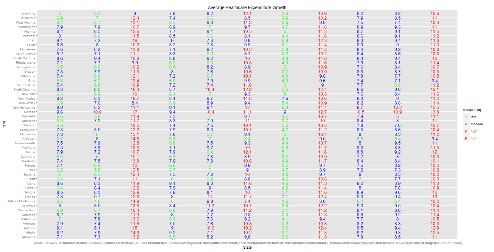

#Health Care and Causes of Death by State

####Final Project for Dr. Cannata's Data Visualization Class


###Introduction


We have been working with these same two datasets (first is US healthcare expenditures over time, and second is US Causes of Death by State) for multiple R projects, so it was interesting to finally work with this data in Tableau. With the enhanced capability of Tableau, we wanted to drill down deeper into healthcare expenditures by item (hospital care, dental care, prescription drugs, etc.) and correlate these figures with deaths.


###Loading our data from the Oracle Database


First, we loaded in our data from the Oracle database as follows. We added two extra datasets to our primary two datasets we'd been using throughout this class.

Our first dataset (COD) describes causes of death by State from 1999 - 2012. An important statistic to note here is AADR, which is the age-adjusted death rate. Below is a head and summary.

```{r}
source("../01 Data/COD_ETL.R", echo = TRUE)
```


Our second dataset (NHCE) describes national healthcare expenditures by item, region, and state from 1980 - 2009. An important additional statistic here is average annual percent growth. Below is a head and summary.

```{r}
source("../01 Data/NHCE_ETL.R", echo = TRUE)
```


Our third dataset (state_pop) describes state population by state, along with average percent growth, from 2000 - 2009. Below is a head and summary.

```{r}
source("../01 Data/StatePop_ETL.R", echo = TRUE)
```


Our fourth dataset (Inflation) gives the inflation rate from 1980 - 2009. Below is a head and summary.

```{r}
source("../01 Data/Inflation_ETL.R", echo = TRUE)
```


We created each of our visualizations in Tableau, then R workflows, then finally SQL and Shiny.


###Visualization #1: Texas Leading Causes of Death 1999 - 2013


```{r}
source("../01 Data/Graph1.R", echo = TRUE)
```


###Visualization 2: Effects of drug spending and Suicide


```{r}
source("../01 Data/Graph2.R", echo = TRUE)
```


###Visualization 3: Effects of Inflation


```{r}
source("../01 Data/Ryan_BarChart_SQL.R", echo = TRUE)
```


###Visualization 4: Healthcare Expenditures by State


Thus far, we have looked at healthcare from a local and science-focused perspective and then a macro, economics-focused perspective. The final set of visualizations in this project will analyze healthcare expenditures per capita by region and item to give a better understanding of where the US healthcare system's inefficiencies lie.

First, we created a Crosstab with a KPI to view the average growth in healthcare expenditures over the past 30 years by State and Item. The KPI classified growth less than 7% as 'Low' (colored green), between 7-10% as 'Medium' (colored blue), and greater than 10% as 'High' (colored red). It gives a quick glance at the fastest-growing expenditures, unadjusted for inflation, allowing us to compare their relative growth rates. 





```{r}
source("../01 Data/Varun_Crosstab - Average Exp Growth.R", echo = TRUE)
```


The red numbers show the items of highest growth (Prescription Drugs and Home Healthcare). This makes sense because people are spending a lot more on drugs with new discoveries in the pharmaceutical industry. Furthermore, increased wealth and medical advances allow elderly patients to live longer, spurring the rise in home healthcare expenses. The green numbers show the items of lowest growth (Durable Medical Products, Other Non-Durable Medical Products, Dental Services, and Hospital Care). The first two were unsurprising because of the commercialization of these products (corporations can continue to offer higher value for lower prices). The second two were also unsurprising since they are more closely tied to inflation and population growth.

The corresponding fourth tab in Shiny shows a web-hosted version of this crosstab with sliders for the KPi's.


Second, we wanted to get a better regional understanding of healthcare expenditures per capita. Therefore, we created a bar chart ranking states by healthcare expenditures per capita in 2009, colored by region, and filtered by Item.


```{r}
source("../01 Data/Varun_Bar Chart - Exp per Capita.R", echo = TRUE)
```


Healthcare expenditures per capita are highest in Washington, D.C., especially hospital care and personal healthcare. We theorized this was the case because all federal expenditures were probably allocated there. Another interesting result we observed was that the more urban, densely populated regions had higher per capita expenditures while the more sparsely populated regions like Rocky Mountains and Plains were lower. This is likely because people in urban areas have more access to healthcare and are therefore more likely to spend money on such services.

We chose not to host this chart in Shiny because it would be unnecessarily redundant.


The third and final visualization in this section was created exclusively in Tableau. We wanted to see the above results in map form to better see the regional clustering. A screen capture of the Tableau workbook is displayed below. Filtering by item and region allows for greater insight into specific areas.


###Conclusion


This project is very useful to understand healthcare in the US and how trends in the past 30 years influence healthcare companies, healthcare policy, and healthcare innovation. First, we observed that an increasing number of deaths are attributed to poor lifestyle choices over genetic or natural causes. Second, we found that prescription drug spending and deaths by suicide are highly correlated acrosss states. Third, we found that healthcare expenditure growth is outpacing inflation. Finally, we observed that expenditure growth is highest for technology-centric items in densely populated areas. Policymakers and corporations can use this data to encourage healthier lifestyles, support mental health, and focus efforts in urban areas to reverse this trend of rising expenditures, leaving more money in Americans' pockets and contributing to a healthier society.